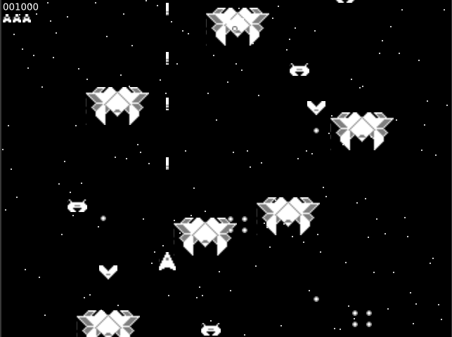

# pygtk4game

PyGObject Gtk4 2D action game.

This is the python version of the [Proof of Concept for a Gtk4 2D action game written in c](https://github.com/lavalfils/poc_gtk4_2D_action_game) using the [PyGObject](https://pygobject.readthedocs.io/en/latest/index.html) python package.

## Requirements

* Python 3 (tested with Python 3.10.6)
* PyGObject (Check the [PyGObject online doc](https://pygobject.readthedocs.io/en/latest/getting_started.html) for installation steps) 
* Gtk4

## How to play

* Arrow keys to move ship
* Space bar to shoot



## Run
```
python3 game.py
```
